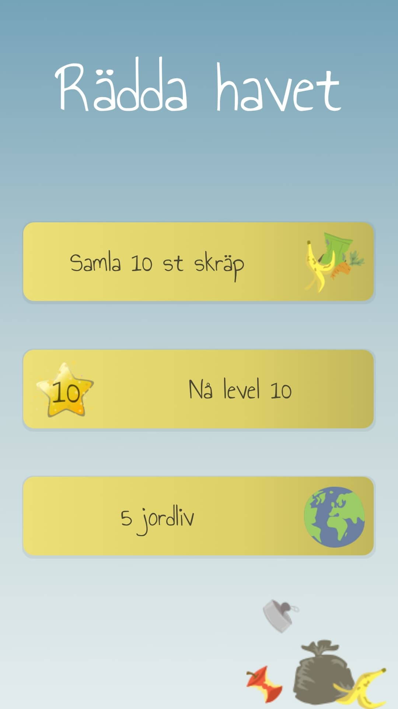
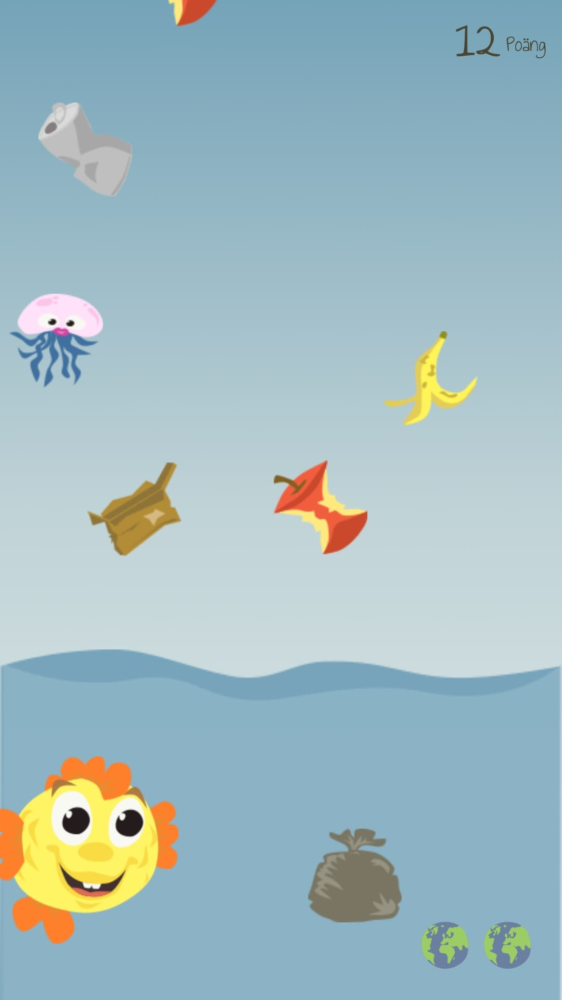
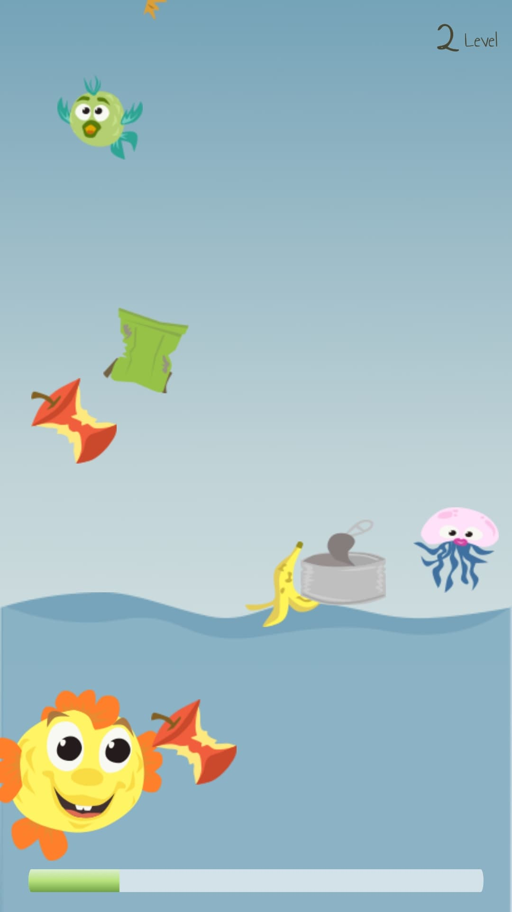

# Save the ocean

A children game where the player must catch rubbish and save the ocean from littering.  

While playing the children gets the first meeting with the importance of take care of our nature and learn finger skills. 
Target group is children 2-4 years.

## Screenshots from game

  

